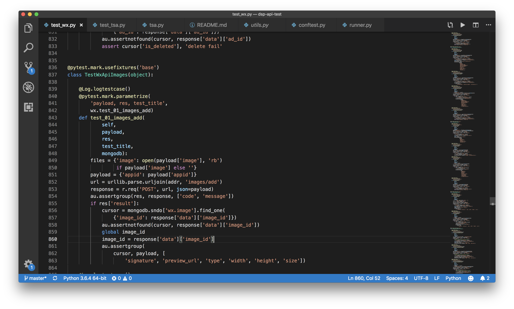

# [dsp-api-testing](https://git.vm.snqu.com/snqu-network/sndo/automated-testing) DSP API测试食用手册

------
使用[Python](https://www.python.org)组合工具[Reuqests](https://github.com/requests/requests)，[pymongo](https://github.com/mongodb/mongo-python-driver)实现对dsp api自动化测试。使用 Requests 作为底层框架，[Pytest](https://docs.pytest.org/en/latest/) 作为测试管理工具，[Allure](http://allure.qatools.ru) 作为报告输出工具。
目录结构如下：

>  dsp-api-testing<br>
>   |-misc<br>
>   |-parameters<br>
>   |&nbsp;&nbsp;&nbsp;&nbsp;|-tsa.py<br>
>   |&nbsp;&nbsp;&nbsp;&nbsp;|-wx.py<br>
>   |<br>
>   |-report<br>
>   |<br>
>   |-tests<br>
>   |&nbsp;&nbsp;&nbsp;&nbsp;|-test_tsa.py<br>
>   |&nbsp;&nbsp;&nbsp;&nbsp;|-test_wx.py<br>
>   |<br>
>   -.gitignore<br>
>   -config.ini<br>
>   -conftest.py<br>
>   -Pipfile<br>
>   -Pipfile.lock<br>
>   -README.md<br>
>   -runner.py<br>
>   -utils.py<br>

## [dsp-api-testing](https://git.vm.snqu.com/snqu-network/sndo/automated-testing) 结构文件说明
### misc
存放其他文件或临时文件目录，其中audiencefile.zip与video.webm文件将作为现测试用例中必须资源存在，请在实现自动生成文件前不要对其进行手动删除
### parameters
存放参数化数据文件
* test_tsa.py
广点通业务参数化数据文件，通过添加不同的参数化配置信息，以达到扩充测试场景的目的
* test_wx.py
微信业务参数化数据文件，通过添加不同的参数化配置信息，以达到扩充测试场景的目的
### report
存放测试结果以及测试报告，其中测试结果由**Pytest**执行用例后生成，测试报告由**Allure**在执行完成后配置Pytest的结果生成，可通过网页进行查看<br>
测试结果文件：****.json<br>
测试报告入口：/html/index.html
### tests
存放测试文件，测试文件需要以**test_xxxx**开头
* test_tsa.py 广点通测试用例<br>
* test_wx.py 微信测试用例<br>
在测试类中，测试函数同样需要以**test_xxxx**开头。测试文件包含测试用例，可单独进行测试的运行与调试
###### .gitgnore
git忽略文件，避免提交不必要文件
###### config.ini
配置文件，包含测试用例指定的测试地址
###### conftest.py
**Pytest**的全局挂钩，实现测试setUp与tearDown
###### README.md
介绍文件
###### Pipfile
pipenv 配置的依赖版本管理文件
###### Pipfile.lock
pipenv 配置的依赖版本管理锁文件，此文件指纹信息自动生成
###### runner.py
批量执行测试入口文件（测试完成后将会自动生成网页版测试报告「该测试报告由[Allure](http://allure.qatools.ru)提供支持」）
###### utils.py
通用工具文件, 提供生成日志，获取文件路径，数据生成与断言判断等实现

------

## 所需依赖、插件及安装即使用方式
#### 依赖
pytest==4.1.0<br>
allure-pytest==2.5.4<br>
requests==2.21.0<br>
pymongo==3.7.2<br>
sshtunnel==0.1.4<br>
#### 依赖安装
1. 安装虚拟环境
   >pip install pipenv
2. 安装所需依赖
   >pipenv sync
#### 依赖使用
##### 使用pipenv虚拟环境
1. 创建虚拟环境
   >pipenv --python 3.6
2. 激活虚拟环境
   >pipenv shell
3. 安装新的依赖
   >pipenv install requests
4. 查看虚拟环境依赖列表
   >pipenv graph
5. 同步虚拟环境依赖的安装
   >pipenv sync
##### 使用pytest
<span style="color:red">注意：需包含必要的pytest或unittest文件</span><br>
###### 执行某个测试文件
>pytest ./tests/test_tsa.py
###### 执行某个测试文件中的某个测试组
>pytest ./tests/test_tsa.py::TestTsaAdvertiser
###### 执行某个测试文件中的某个测试组中的某个测试用例
>pytest ./tests/test_tsa.py::TestTsaAdvertiser::test_01_advertiser_add

#### 插件
allure==2.8.1
#### 插件安装
##### MacOS
>brew install allure
##### Windows
>scoop install allure
#### 插件使用
##### 输出html测试报告
使用allure可以轻松的输出友好的测试报告，输出命令为:<br>
<span style="color:red">注意：需包含必要的测试结果文件</span><br>
>allure generate [report_path] -o [html_report_path]

report_path:代表测试结果所在的文件夹<br>
html_report_path:代表输出的html报告文件夹<br>
##### 查看测试结果
使用命令行工具
>allure serve [path_of_report]<br>

报告模版首页

报告模版详情


可以直接启动allure服务并查看测试结果<br>
<span style="color:red">注意：直接打开*index.html*在某些浏览器中将显示结果为*404 not found*</span><br>
------

## 调试&运行
### 调试
通过**tests**目录下的单独**test_xxxx**运行测试，适用范围仅限于当前测试文件
示例：
>pytest ./tests/test_tsa.py::TestTsaAdvertiser::test_01_advertiser_add


示例：输出结果

### 运行
通过**runner.py**文件指定运行，运行指定测试目录默认为**tests**目录

------

## 注意
1. 忽略接口：<br>
tsa:<br>
    debug/auth
    adcreative_previews<br>
    promoted_objects<br>
    pages(需正式服，且落地页审核通过)<br>
目前遗漏：（未有mongo数据保存）<br>
wx:<br>
    custom_audiences(有用例，但mongo无数据结构)<br>
    
2. 返回值错误：<br>
{'code': 10000, 'message': 'We are unable to process your request at this time. Please retry your request. If you encounter this error repeatedly, please contact our dedicated supporting team.'} 测试服常见，腾讯方面原因，无法解决，建议重跑<br>

3. 广电通资质相关<br>
广点通创建资质，参数所传账号系统状态(system_status)必须不为CUSTOMER_STATUS_NORMAL，否则不能创建成功

------

## 测试用例
#### 详细描述
测试用例文件的结构如下：<br>
测试文件>测试组（测试类）>测试用例<br>
可以有多个测试文件，测试文件中也可以有多个测试组，测试组中可以有多个测试用例。测试用例是测试执行的最小单元。
以下为一个具体的测试用例：<br>
```
@pytest.mark.usefixtures('base')    # 该装饰器用以标注测试组使用pytest进行配置
class TestWxApiImages(object):

    @Log.logtestcase()  # 该装饰器用以进行测试用例的日志输出
    @pytest.mark.parametrize(   # 该测试用例用以进行测试用例的参数化操作
        'payload, res, test_title', # 固定模版，payload为入参参数，res为测试结果，test_title为测试标题
        wx.test_01_images_add)  # 参数化文件
    def test_01_images_add(
            self,
            payload,
            res,
            test_title,
            mongodb):   # mongodb 的实例，仅在初始化测试时开启，测试结束后关闭
        files = {'image': open(payload['image'], 'rb')  # 确认请求参数
                 if payload['image'] else ''}
        payload = {'appid': payload['appid']}
        url = urllib.parse.urljoin(addr, 'images/add')  # 拼接请求 url
        response = r.req('POST', url, json=payload) # 请求并获取返回值
        au.assertgroup(res, response, ['code', 'message'])  # assertgroup对异组相同参数进行值校验
        if res['result']:
            cursor = mongodb.sndo['wx.image'].find_one( # 使用mongo读取数据库数值
                {'image_id': response['data']['image_id']})
            au.assertnotfound(cursor, response['data']['image_id']) # assertnotfound返回值是否存在
            global image_id # 设置全局变量，该变量可跨越多个测试用例
            image_id = response['data']['image_id']
            au.assertgroup(
                cursor, payload, [
                    'signature', 'preview_url', 'type', 'width', 'height', 'size'])
```
